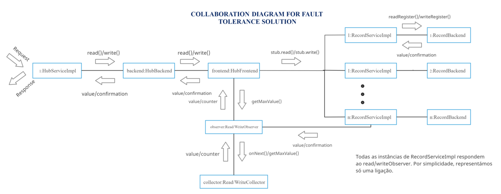

# Relatório do projeto *Bicloin*

Sistemas Distribuídos 2020-2021, segundo semestre

## Autores

**Grupo A71**

Álvaro Saldanha, Guilherme Fernandes

| Número | Nome                 | Utilizador                                   | Correio eletrónico                  |
| -------|----------------------|----------------------------------------------| ------------------------------------|
| 92416  | Álvaro Saldanha      | <https://git.rnl.tecnico.ulisboa.pt/ist192416> | <alvaro.saldanha@tecnico.ulisboa.pt>   |
| 92473  | Guilherme Fernandes  | <https://git.rnl.tecnico.ulisboa.pt/ist192473> | <g.mimoso.fernandes@tecnico.ulisboa.pt>     |

## Melhorias da primeira parte

- [Alteração e melhoria da utilização de variáveis de sincronização no Hub](https://git.rnl.tecnico.ulisboa.pt/SD-20-21-2/A71-Bicloin/commit/f4b652ff9e732fd1ddcf1a14a9e3c6e2c67cda6d)
- [Configuração correta dos POMs](https://git.rnl.tecnico.ulisboa.pt/SD-20-21-2/A71-Bicloin/commit/3a07e2cff7704ee48245878e00e26e49ace946cd)

## Modelo de faltas
A solução apresentada representa um sistema assíncrono que não tem garantia que todas as mensagens sejam entregues e recebidas corretamente. Neste sentido, são necessários mecanismos para lidar com eventuais omissões de mensagens e falhas nos recs.
Sendo que o rec apenas falha silenciosamente (não pode falhar arbitrariamente) e que apenas uma minoria de recs pode falhar simultaneamente, o sistema garante funcionamento correto se uma maioria de réplicas estiver ativa. Não são toleradas falhas de mais réplicas que uma minoria. Operações de leitura e escrita podem tolerar diferentes números de falhas de réplicas, dependendo dos quoruns estabelecidos para cada. Um rec pode falhar e voltar a ser ativado no mesmo endereço ou num novo, visto que as falhas destes são transientes e não definitivas, mantendo as suas cópias dos dados no momento em que falhou.
Assume-se que não ocorrem falhas no hub enquanto este trata de um procedimento remoto.
Considera-se também que o Zookeeper está sempre ativo e funcional.

## Solução

No diagrama acima, está representada uma perspectiva simplificada da solução. Existem quoruns diferentes para as operações de leitura e de escrita, calculados em função do número total de recs. Este cálculo está detalhado na penúltima secção do relatório. O HubFrontend, ao receber um pedido de read/write, tenta contactar todos os recs que sabe que existe e espera por receber o quorun de respostas destes. Sendo assim, dependendo do quorun necessário, este vai tolerar um certo número de falhas nas réplicas do rec, se garantir que recebe as respostas/confirmações que precisa. Na próxima secção detalhamos o processo concretamente. 

## Protocolo de replicação

Ao receber uma chamada a um procedimento remoto que envolva ler o escrever informação nos recs, o Hub utiliza o HubFrontend para abstrair a comunicação assíncrona com os recs. O HubFrontend é responsável por contactar todos os recs de que tem conhecimento e enviar um pedido de read ou de write a estes, sendo que uma operação de write envolve sempre um read prévio.
O rec utiliza números de sequência para controlo de versões nos registos. Ou seja, se um registo tem número de sequência 0 e é realizada uma escrita neste, este é atualizado para 1. Cada rec guarda a sua versão dos dados, podendo estes diferir de rec para rec mediante possíveis falhas/atrasos na comunicação ou nos recs.
Para cada operação de read ou de write, o HubFrontend cria um Observer que tem como função receber as respostas ou os erros devolvidos pelos recs. Cada Observer tem um Collector que guarda as respostas recebidas e calcula qual a resposta com o número de sequência maior. Cada resposta pode guardar o valor lido do registo e o número de sequência deste. Os operações de leitura necessitam apenas de um Observer, enquanto as de escrita precisam de dois (um para o read do sequence number).
O HubFrontend espera até ser notificado da receção de um quorun de respostas do rec pelo Observer. Ou seja, tem de existir um número mínimo de recs ativos e funcionais para que seja possível realizar leituras e escritas. O cálculo deste quorun difere entre as duas operações, porém, garante que os recs que respondem a uma leitura sobrepõem-se sempre com os recs que confirmam uma escrita, garantindo que a informação lida é a mais recente. Ao receber uma resposta, o Observer vai notificar o HubFrontend e vai guardar a resposta recebida no Collector, assim como registar o número de respostas já recebido. O HubFrontend vai assim sair do wait() e consultar se já atingiu o quoron necessário. Dependendo do resultado, este sai do estado de espera ou mantem-se enquanto aguarda por mais notificações.
O rec guarda os números de sequência dos registos e, ao receber um pedido write, confirma se o número de sequência que se pretende escrever é maior do que o que tem guardado. Se for esse o caso, escreve os novos dados no registo. Assim, o frontend, no caso de uma escrita, tem de ler antes qual o número de sequência maior guardado nos recs e enviar o pedido de write com esse número + 1. No caso de uma leitura, o frontend escolhe o valor lido, consultando qual das respostas retorna o número de sequência maior. Existe um caso especial da escrita em que o rec recebe o número de sequência 0 e faz sempre "overwrite" aos dados que estão no registo. Isto acontece pois o número 0 só pode ser recebido na inicialização de dados, substituindo assim os dados já não desejados pelos iniciais no arranque do sistema.
O Hub utiliza mecanismos de sincronização para garantir que não seja possível escrever/ler os registos referentes a um utilizador/estação concorrentemente, garantido assim coerência sequencial. É realizado um lock ao utilizador/estação no inicio do procedimento remoto, que impede o acesso de outra thread concorrente que pretenda utilizar o mesmo utilizador/estação.
O Zookeeper é consultado em cada operação de leitura ou escrita para garantir que o sistema suporta a alteração de endereço por parte de um ou mais recs em tempo real. O quoron para cade operação é calculado em função do número de réplicas registadas no Zookeeper na inicialização do Hub.

## Medições de desempenho

Após implementar um algoritmo base, utilizando 4 recs e 2 clientes concorrentes, foi utilizado o ficheiro comandos.txt (presente diretoria /app) para realizar as seguintes medições de desempenho:

- Tempo total de execução: 37,148 segundos.
- Tempo médio por chamada remota: 0.402 segundos.
- Operações de leitura (reads): 501
- Operações de escrita (writes): 164
- Rácio de escritas/leituras: ~0.33%

Tabela 1 [Medições De Performance Algoritmo Base]:

| Operação | Quantidade                | Tempo médio por chamada (em segundos)          | 
| ---------|---------------------------|------------------------------------------------| 
| Ping     | 18                        | 0.264                                          | 
| Balance  | 46                        | 0.159                                          | 
| TopUp    | 20                        | 0.366                                          |
| Info     | 30                        | 0.337                                          | 
| Scan     | 24                        | 0.372                                          | 
| BikeUp   | 26                        | 0.905                                          | 
| BikeDown | 26                        | 0.974                                          | 
| SysStatus| 14                        | 0.277                                          | 

Foram então realizadas optimizações ao algortimo implementado, assim como melhorias gerais no código para aumentar a eficiência do sistema. Estas optimizações
estão descritas na próxima secção do relatório.
Após estas alterações, utilizando as mesmas condições das medições anteriores, os resultados obtidos foram os seguintes:

- Tempo total de execução: 23.523 segundos.
- Tempo médio por chamada remota: 0.247 segundos.
- Operações de leitura (reads): 501
- Operações de escrita (writes): 164
- Rácio de escritas/leituras: ~0.33%

Tabela 2 [Medições De Performance Pós-Optimizações]:

| Operação | Quantidade                | Tempo médio por chamada (em segundos)          | 
| ---------|---------------------------|------------------------------------------------| 
| Ping     | 18                        | 0.135                                         | 
| Balance  | 46                        | 0.81                                          | 
| TopUp    | 20                        | 0.211                                          |
| Info     | 30                        | 0.178                                          | 
| Scan     | 24                        | 0.297                                          | 
| BikeUp   | 26                        | 0.583                                          | 
| BikeDown | 26                        | 0.539                                          | 
| SysStatus| 14                        | 0.195                                          | 

Claramente as optimizações tiveram um impacto significativo na eficiência do sistema, reduzindo bastante não só o tempo de execução total, como também o tempo médio de cada operação/chamada. Entre as duas medições o tempo total de execução diminui cerca de 37% e o tempo médio por chamada remota 39%.

## Opções de implementação

Inicialmente, o grupo desenvolveu uma solução com um algoritmo base simples, que foi utilizado para as medições da tabela 1. Este envolvia deixar o HubFrontend em espera ativa enquanto esperava pelo quorun de respostas dos recs, assim como um mecanismo de write-back após cada operação read que, após ler dados de um registo, tentava escrever esses dados em todos os recs para evitar possíveis escritas incompletas.
A primeira optimização realizada foi a adopção de mecanismos de sincronização utilizando wait() e notify() para substituir a espera ativa no HubFrontend. O HubFrontend fica à espera (wait()) que o número de notify()s feitos de Observer seja igual ao quorun necessário.
De seguida, foi retirado o write-back, visto que o grupo chegou à conclusão que a existência deste não faria sentido se o Hub é responsável por não deixar várias threads concorrentes aceder a registos referentes aos mesmos utilizadores/estações.
Foi também revista e melhorada a sincronização geral no hub, tendo sido alterados alguns usos de variáveis de sincronização que poderiam prejudicar a performance do sistema.
O grupo experimentou também ter quoruns diferenciados para as operações de read/write, sendo o quorun menor para o read e maior para o write visto que os reads são significativamente mais frequentes (nos dados obtidos, 501 >> 164, rácio write/read: ~0.33%). Escolhemos tal que o quorun do read fosse cerca de um terço do número de réplicas do rec total, sendo o do write dois terços do número de recs + 1, mantendo assim as condições necessárias: WT > nRec/2 e WT + RD > nRec. Esta alteração permite reduzir fortemente o tempo de espera das operações de leitura, garantido sempre que estas devolvem o valor correto.

Estas optimizações apresentaram uma significante melhoria na eficiência do sistema, como é evidente pela tabela 2. 

## Notas finais

A solução desenvolvida pelo grupo demonstra eficiência, mesmo com multiplos utilizadores e aparenta garantir leituras e escritas coerentes. Em termos de tolerância de faltas, a solução garante que consegue lidar com uma minoria de faltas de réplicas de recs, dependendo do número destes disponível. As optimizações realizadas depois da implementação do algortimo base mostraram-se eficazes e elevaram o grau de produtividade do sistema, assim como, a competência geral deste. Na demosntração, é possível consultar o seu funcionamento.
